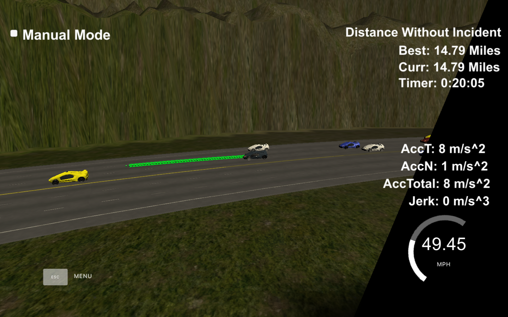

# CarND-Path-Planning-Project
Self-Driving Car Engineer Nanodegree Program

## Introduction
The aim of this project is to make the car follow a smooth trajectory that is safe. There are vehicles on the highway going at different speeds, the speed limit is 50 MPH.

My implementation consists of the following:

* FSM: consisting of these states: KEEP LANE (KL), PREPARE CHANGE LANE (PCL), CHANGE LANE (CL)
* Predictions: Other vehicle's location is predicted using their locations and current speed.
* Cost function: a cost function for lane changing has these sub-components: 
  A) cost is calculated based on possibility of a collision taking into consideration the predicted location. 
  B) cost is calculated based on lane-speed, by looking at the speed of the closest upfront vehicle in that lane.
* New Path: A smooth path is generated, using anchor points at 30, 60, 90 meters ahead, and then interpolating smooth subsequent points using the spline.h library. The intermediate points are spaced out so that the resulting velocity of the vehicle is equal to the desired value.

## FSM
KEEP LANE (KL):
The car starts at the center lane, with velocity set to zero and state set to KL. 

PREPARE CHANGE LANE (PCL):
When there is another car infront that is going slower than our desired velocity, we look for another lane and the car goes into PCL state.

CHANGE LANE (CL):
When the car finds out it a safe time to change lanes, the car goes into CL state.

see 
https://github.com/ajaffer/CarND-Path-Planning-Project/blob/c54547f86c936c25f51ef407b7aab4539493b3e8/src/main.cpp#L298

## Predictions
Reading the other car's current location and their speeds, we can predict what location that car will and also can predict our car's location as well.

## Cost Functions
For a lane change, we use the following cost functions:

Predicted Collisions:
A collision may happen when we change our lane and end up being within a close range of the predicted location of another car.

Slow lane speeds:
A cost function based on the lane speeds, is calculated based on the difference in speeds of our car and other cars that are already in that lane and infront of us.

see cost_of_changing_lanes
https://github.com/ajaffer/CarND-Path-Planning-Project/blob/c54547f86c936c25f51ef407b7aab4539493b3e8/src/main.cpp#L181

## Summary
The car starts in the center lane, with speed set to zero and FSM at KL. The car gently increments/decrements it's speed, in order for the car to not experience total acceleration over 10 m/s^2 and jerk greater than 10 m/s^3. The car will go at a max speed of around 49.5 MPH, in order to be as close to the speed limit.

The path planner in this project is working well, the car is able to go around in the highway without any collision, or jerk warnings. It is able to change lanes smoothly and moves into faster lanes when possible.

